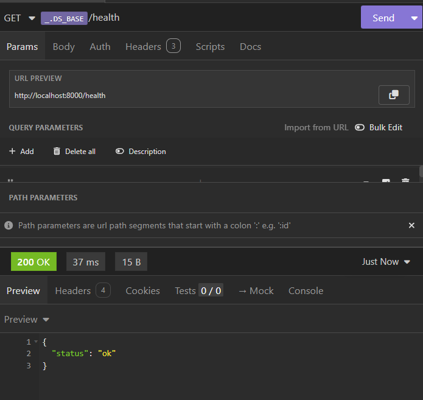
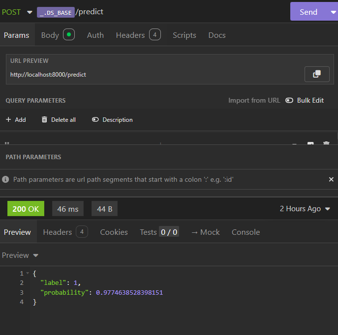
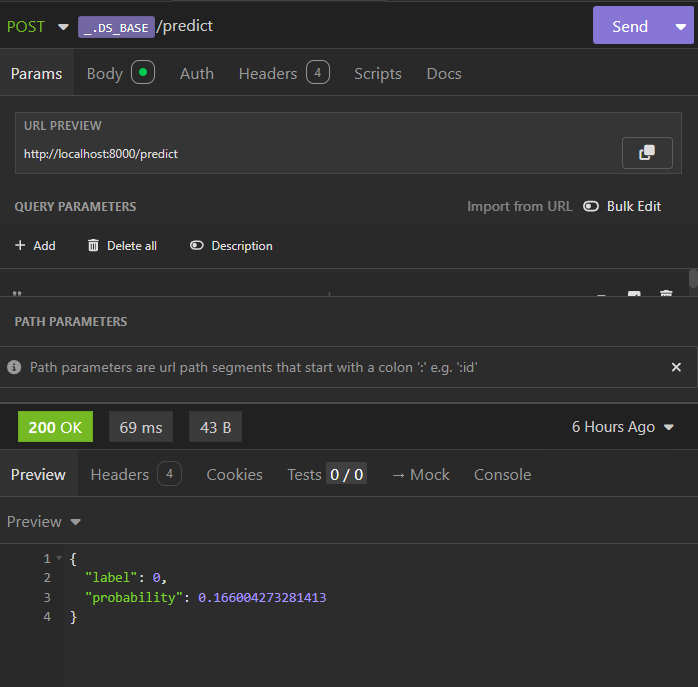
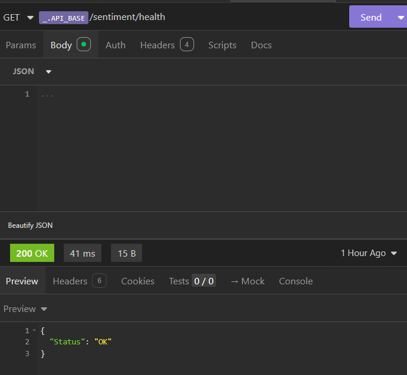
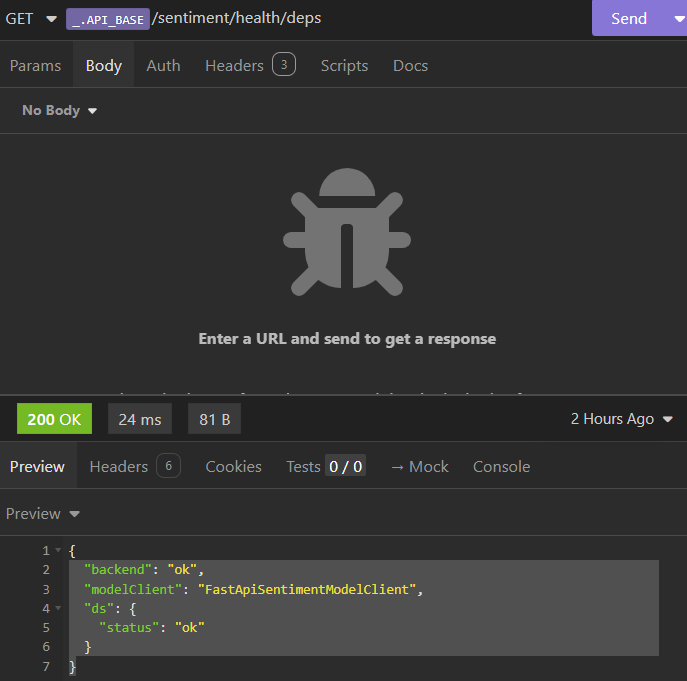
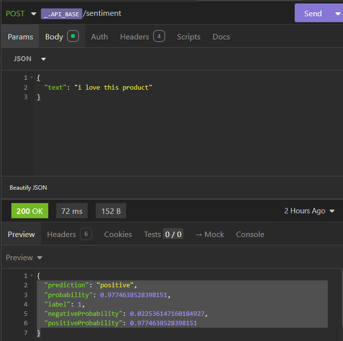
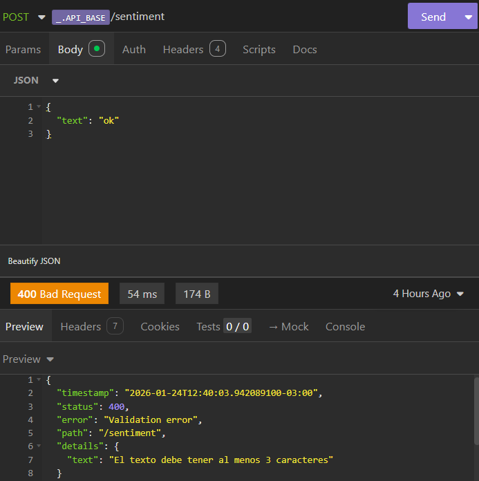
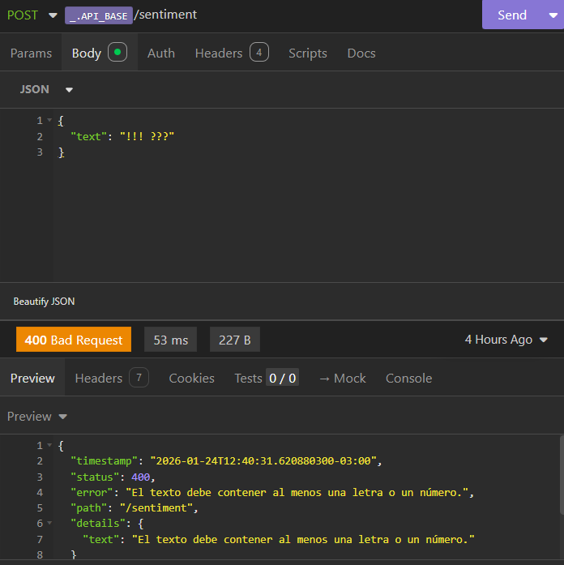
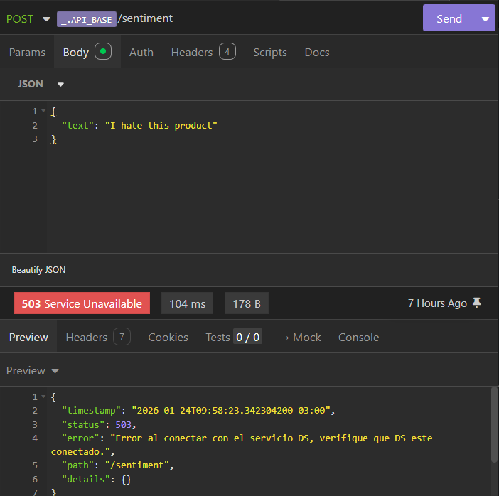

# Plan de Pruebas (Demo / Smoke Tests)

Este documento valida el flujo completo:

**Web UI → Spring Boot API → FastAPI DS (modelo)**

---

## 1) Prerrequisitos

- **DS (FastAPI)** corriendo en `http://localhost:8000`
- **API (Spring Boot)** corriendo en `http://localhost:8080`
- **Web UI** servida (por ejemplo con Live Server) en `http://127.0.0.1:5500`

Herramientas recomendadas:
- Insomnia (para requests)
- VSCode (Web UI y API)
- IntelliJ (Backend)

---

## 2) Orden de arranque (importante)

1. Iniciar **DS (FastAPI)**  
2. Iniciar **API (Spring Boot)**  
3. Abrir **Web UI** (Live Server)

---

## 3) Variables sugeridas en Insomnia

- `DS_BASE = http://localhost:8000`
- `API_BASE = http://localhost:8080`

---

## 4) Smoke Tests (DS)

### 4.1 DS Health
**GET** `${DS_BASE}/health`  
- Esperado: 
    * `200 OK`

```json
    {
        "status": "ok" 
    }
```



### 4.2 DS Predict Positive 
**POST** `${DS_BASE}/predict`
```json
    {
        "text":"I love this product"
    }
```
- Esperado:
```json
    {
	    "label": 1,
	    "probability": 0.9774638528398151
    }
```


### 4.3 DS Predict Negative 
**POST** `${DS_BASE}/predict`
```json
    {
        "text":"I hate this product"
    }
```

- Esperado: 
```json
    {
	    "label": 0,
	    "probability": 0.166004273281413
    }
```



---

## 5) Smoke Tests (API)

### 5.1 API Health
**GET** `${API_BASE}/sentiment/health`
- Esperado:
    * `200 OK`
```json
    {
        "status":"OK"
    }
```



### 5.2 API Dependencies Health
**GET** `${API_BASE}/sentiment/health/deps`
- Esperado:
    * `200 OK`

```json
    {
	    "backend": "ok",
	    "modelClient": "FastApiSentimentModelClient",
	    "ds": {
		    "status": "ok"
	    }
    }
```



### 5.3 API Predict Positive
**POST** `${API_BASE}/sentiment`
```json
    {
        "text":"I love this product"
    }
```
- Esperado:
```json
    {
	    "prediction": "positive",
	    "probability": 0.9774638528398151,
	    "label": 1,
	    "negativeProbability": 0.022536147160184927,
	    "positiveProbability": 0.9774638528398151
    }
```



### 5.4 API Predict Negative
**POST** `${API_BASE}/sentiment`
```json
    {
        "text":"The worst place to buy"
    }
```
- Esperado:
```json
    {
	    "prediction": "negative",
	    "probability": 0.039714164896929034,
	    "label": 0,
	    "negativeProbability": 0.960285835103071,
	    "positiveProbability": 0.039714164896929034
    }
```


## 6) Prueba de errores (API) - Robustez

### 6.1 Short Text (400)
**POST** `${API_BASE}/sentiment`

```json
    {
        "text":"OK"
    }
```
- Esperado:

```json
    {
	    "timestamp": "2026-01-24T12:40:03.942089100-03:00",
	    "status": 400,
	    "error": "Validation error",
	    "path": "/sentiment",
	    "details": {
		    "text": "El texto debe tener al menos 3 caracteres"
	    }
    }
```



### 6.2 Only Symbols (400)
**POST** `${API_BASE}/sentiment`

```json
    {
        "text":"!!! ???"
    }
```
- Esperado:

```json
    {
	    "timestamp": "2026-01-24T12:40:31.620880300-03:00",
	    "status": 400,
	    "error": "El texto debe contener al menos una letra o un número.",
	    "path": "/sentiment",
	    "details": {
		    "text": "El texto debe contener al menos una letra o un número."
	    }
    }
```



### 6.3 DS Down/Disconnected (503)
**POST** `${API_BASE}/sentiment`

```json
    {
        "text":"I hate this product"
    }
```
- Esperado:

```json
    {
	    "timestamp": "2026-01-24T09:58:23.342304200-03:00",
	    "status": 503,
	    "error": "Error al conectar con el servicio DS, verifique que DS este conectado",
	    "path": "/sentiment",
	    "details": {}
    }
```

